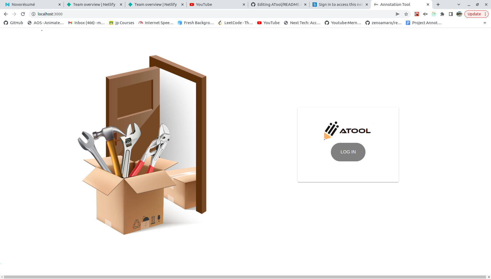
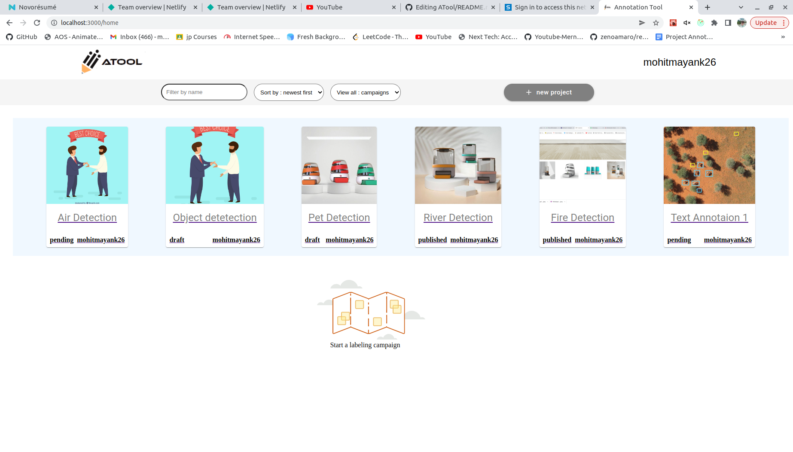
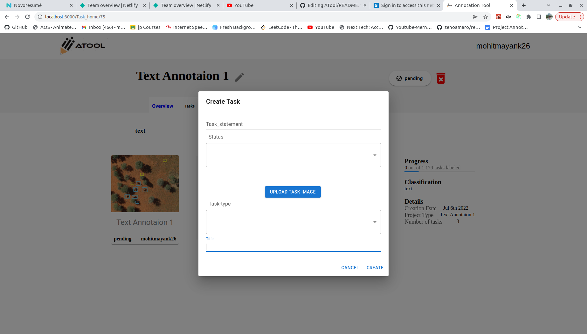
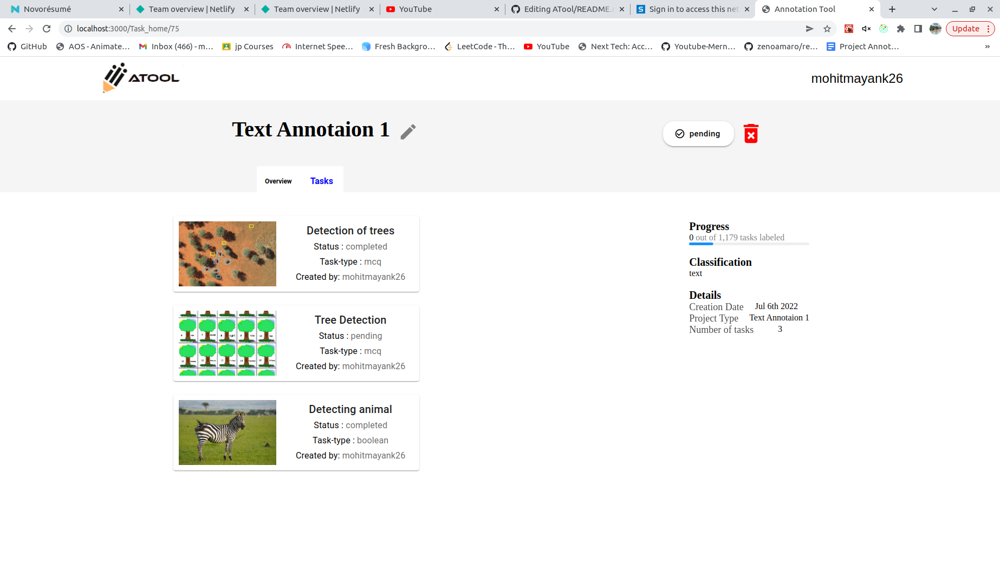
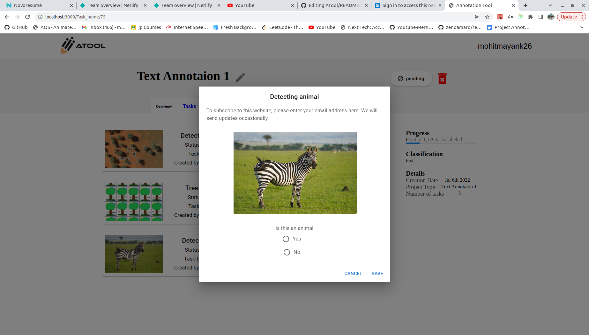

# ATool - An Open Source Survey Tool

Atool is an free, open source survey gathering web-based tool, that can be used by anyone to gather a certain set of data about a userbase.
This tool could be utilised best by individuals like Data Scienists, belonging to major conglomerates, in order to gather a dataset for a vast number of individuals (which could be further used in certain ML/DL algorithms).


## Setup

**1 —** Clone this repository and install the dependencies
```bash
git clone https://github.com/mohit98350/ATool.git
yarn install
npm  install
```

**2 —** Install a Strapi backend

In a another folder, run these commands:
```bash
yarn create strapi-app my-project --quickstart
# or
npx create-strapi-app my-project --quickstart
```

**3 —** Create the Admin user: http://localhost:1337/admin/auth/register

**4 —** Configure one or several providers by following the instructions here: https://strapi.io/documentation/v3.x/plugins/users-permissions.html#providers

**5 -** Launch the app
```bash
REACT_APP_BACKEND_URL=http://localhost:1337 npm start
```
NB: If you use ngrok, use the ngrok url for `REACT_APP_BACKEND_URL` instead of `http://localhost:1337`

## Env vars
| Name | Description | Example |
| - | - | - |
| **REACT_APP_BACKEND_URL** | **Required.** The absolute url of your Strapi app. | `http://localhost:1337` |

## Tools

- React
- Redux
- Material UI
- Stapi

## Preview

<p align="center">
   
&nbsp;
   
&nbsp;
   
<br />
<br />
   
&nbsp;
   
&nbsp;
   
<br />

</p>
