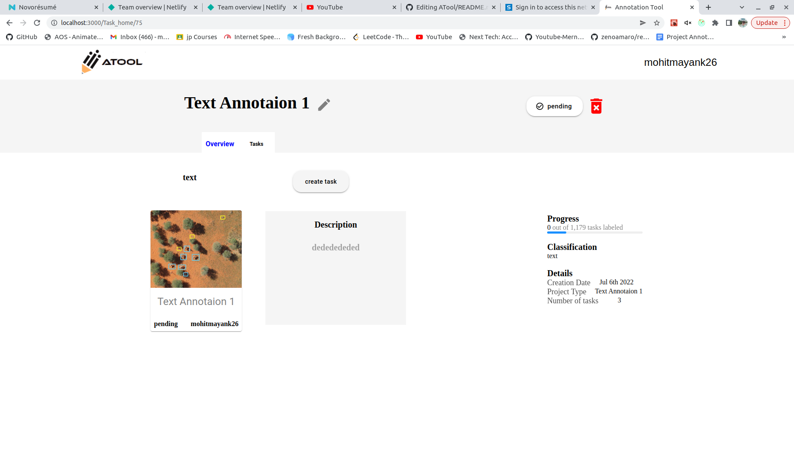

# Login Flow Example

Basic app that shows how to implement login with a third party login provider.

## Setup

**1 —** Clone this repository and install the dependencies
```bash
git clone git@github.com:strapi/strapi-examples.git
cd strapi-examples/login-react
yarn install
```

**2 —** Install a Strapi backend

In a another folder, run these commands:
```bash
yarn create strapi-app my-project --quickstart
# or
npx create-strapi-app my-project --quickstart
```

**3 —** Create the Admin user: http://localhost:1337/admin/auth/register

**4 —** Configure one or several providers by following the instructions here: https://strapi.io/documentation/v3.x/plugins/users-permissions.html#providers

**5 -** Launch the app
```bash
REACT_APP_BACKEND_URL=http://localhost:1337 yarn start
```
NB: If you use ngrok, use the ngrok url for `REACT_APP_BACKEND_URL` instead of `http://localhost:1337`

## Env vars
| Name | Description | Example |
| - | - | - |
| **REACT_APP_BACKEND_URL** | **Required.** The absolute url of your Strapi app. | `http://localhost:1337` |

<p align="center">
   
&nbsp;
   
&nbsp;
   
<br />
<br />
   
&nbsp;
   
&nbsp;
   
<br />

</p>
